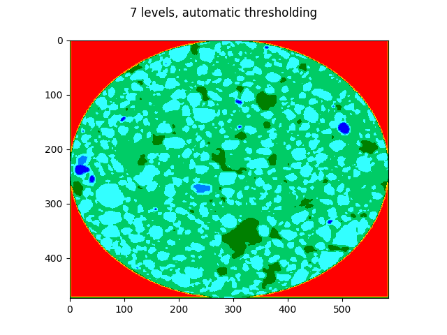
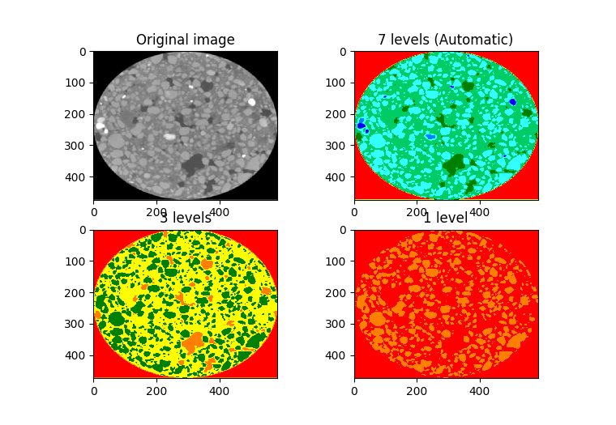
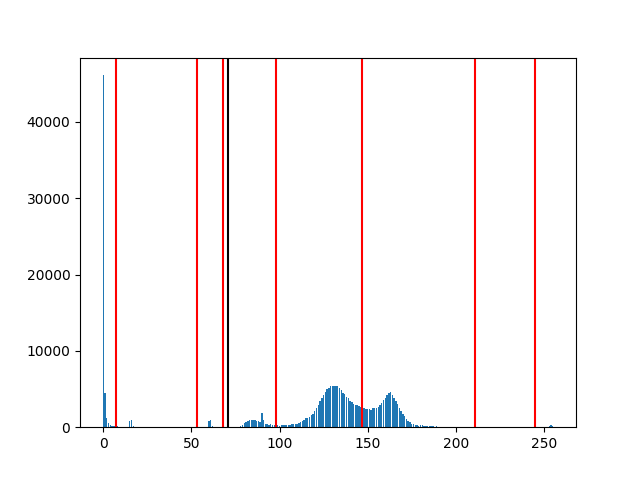

# Improved two-stage multithreshold Otsu method.

This is an implementation of the method described in:

```
Huang, D. Y., Lin, T. W., & Hu, W. C. (2011).
Automatic multilevel thresholding based on two-stage Otsu’s method with cluster determination by valley estimation.
International Journal of Innovative Computing, Information and Control, 7(10), 56315644.
```

## Results
### Select number of thresholds automatically

### Selecting top X threshold values from output (1, 3, auto)

### Threshold values displayed on histogram, black line is value from vanilla Otsu's method

